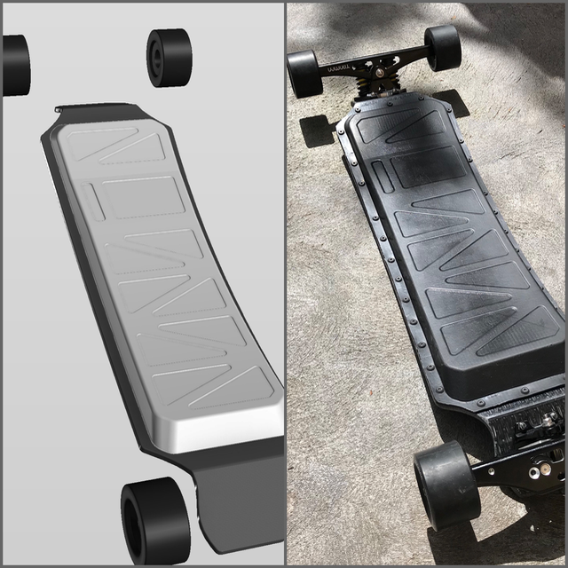

## Enclosure
The enclosure was made from polyurethane, formed in a two part mould. The bottom half of the mould was created from a CAD model as shown below. [CAD models (STEP & STL) can be found in the project repo](https://github.com/lachlanhurst/locks-esk8/tree/master/cad/enclosure).

